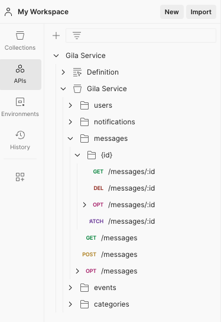

## System Design

Backend:
* API Gateway
* Lambda
* CloudFormation
* CloudWatch
* AWS cdk
* Jest

DynamoDB is used as storage for:
* events collection
* user management
* notifications type
* category names
* messages content

## API REST

Import the [postman.yml](postman.yml) file into Postman as "OpenAPI 3.0 with a Postman Collection" to have full access to all endpoints.

## Possible Bottlenecks

* Create new event
    * Solution: SQS
* Send channel notifications to subscribed users
    * Solution: rate limit API call

## Recommended commands to run this project

* `yarn clean`      delete *.js files and node_modules/
* `yarn`            install dependencies
* `yarn build`      compile typescript to js
* `yarn test`       perform the jest e2e test with real writes to DB
* `yarn deploy`     deploy this stack to your default AWS account/region
* `cdk diff`        compare deployed stack with current state
* `cdk destroy`     Removes all the resources deployed at AWS for this project

## How to start testing?

Open the file [test/gila.test.ts](test/gila.test.ts) and comment the afterEach() method. This will allow you to explore the database state with the help of the endpoints. Default behavior is to clear all data from databases after each test case is completed.

Choose wheater you want to test the simple case "First basic simple case"(Line 77) or the more complex one "Very complex case"(Line 188) and comment the other. Database must be pristine in order for every test case to run successfully as they only work well in isolated mode.
